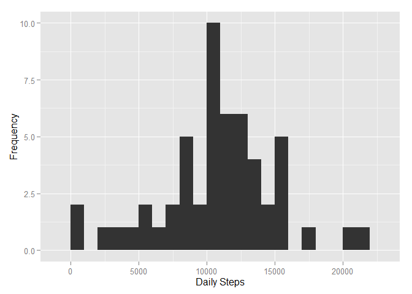
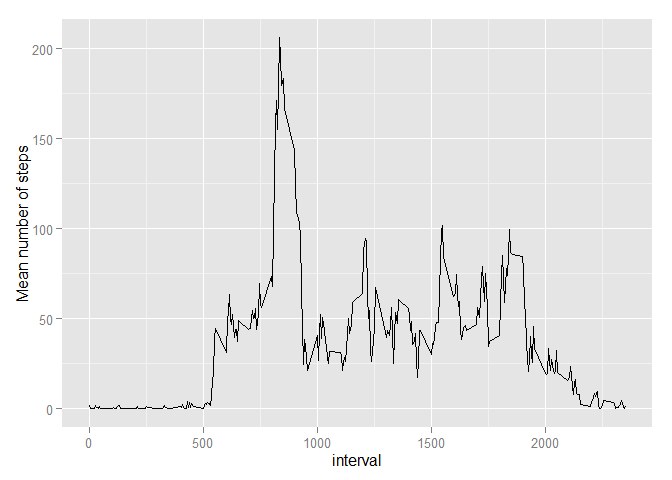
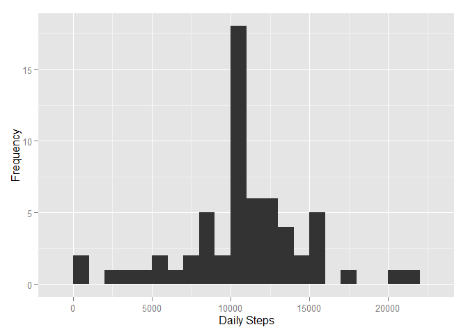
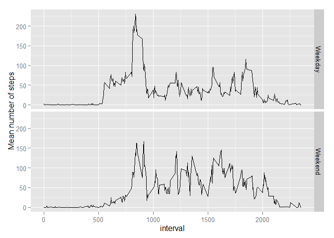

# Reproducible Research: Peer Assessment 1

We first load all the libraries we'll use for this.

```r
library(ggplot2)
library(dplyr)
```


## Loading and preprocessing the data

Here we load the data from the csv file, and convert the dates from factor type to Dates


```r
data <- read.csv("activity.csv")
data$date <- as.Date(data$date)
str(data)
```

```
## 'data.frame':	17568 obs. of  3 variables:
##  $ steps   : int  NA NA NA NA NA NA NA NA NA NA ...
##  $ date    : Date, format: "2012-10-01" "2012-10-01" ...
##  $ interval: int  0 5 10 15 20 25 30 35 40 45 ...
```


## What is mean total number of steps taken per day?

#### Calculate the total number of steps taken per day

```r
stepsByDate <- data %>% 
                filter(!is.na(steps)) %>% 
                group_by(date) %>% 
                summarise(totSteps = sum(steps))
head(stepsByDate)
```

```
## Source: local data frame [6 x 2]
## 
##         date totSteps
## 1 2012-10-02      126
## 2 2012-10-03    11352
## 3 2012-10-04    12116
## 4 2012-10-05    13294
## 5 2012-10-06    15420
## 6 2012-10-07    11015
```

#### Make a histogram of the total number of steps taken each day

```r
qplot(stepsByDate$totSteps, xlab = "Daily Steps", ylab = "Frequency", binwidth = 1000)
```

 

#### Calculate and report the mean and median of the total number of steps taken per day

```r
stepstats <- summary(stepsByDate$totSteps)
stepstats[c(4,3)]
```

```
##   Mean Median 
##  10770  10760
```

## What is the average daily activity pattern?
#### Make a time series plot (i.e. type = "l") of the 5-minute interval (x-axis) and the average number of steps taken, averaged across all days (y-axis)


```r
stepsByInt <- data %>%
                filter(!is.na(steps)) %>% 
                group_by(interval) %>% 
                summarise(avgSteps = mean(steps))

qplot(interval, avgSteps, data = stepsByInt, geom = "line", ylab = "Mean number of steps")
```

 

#### Which 5-minute interval, on average across all the days in the dataset, contains the maximum number of steps?

```r
stepsByInt$interval[which.max(stepsByInt$avgSteps)]
```

```
## [1] 835
```

## Imputing missing values

Note that there are a number of days/intervals where there are missing values (coded as NA). The presence of missing days may introduce bias into some calculations or summaries of the data.

#### Calculate and report the total number of missing values in the dataset (i.e. the total number of rows with NAs)

```r
nrow(data %>% filter(is.na(steps) | is.na(interval) | is.na(date)))
```

```
## [1] 2304
```

#### Devise a strategy for filling in all of the missing values in the dataset. The strategy does not need to be sophisticated. For example, you could use the mean/median for that day, or the mean for that 5-minute interval, etc.
For each missing interval, we will fill it in with the mean for that 5 minute interval

```r
fillStep <- stepsByInt$avgSteps
names(fillStep) <- stepsByInt$interval
```

#### Create a new dataset that is equal to the original dataset but with the missing data filled in.

```r
filled_data <- data %>% 
                mutate(stepsFilled = ifelse(is.na(steps), 
                                        fillStep[as.character(interval)], 
                                        as.numeric(steps)))
head(filled_data)
```

```
##   steps       date interval stepsFilled
## 1    NA 2012-10-01        0   1.7169811
## 2    NA 2012-10-01        5   0.3396226
## 3    NA 2012-10-01       10   0.1320755
## 4    NA 2012-10-01       15   0.1509434
## 5    NA 2012-10-01       20   0.0754717
## 6    NA 2012-10-01       25   2.0943396
```

#### Make a histogram of the total number of steps taken each day
We first compute the total steps taken each day

```r
stepsByDate2 <- filled_data %>% 
                group_by(date) %>% 
                summarise(totSteps = sum(stepsFilled))
head(stepsByDate2)
```

```
## Source: local data frame [6 x 2]
## 
##         date totSteps
## 1 2012-10-01 10766.19
## 2 2012-10-02   126.00
## 3 2012-10-03 11352.00
## 4 2012-10-04 12116.00
## 5 2012-10-05 13294.00
## 6 2012-10-06 15420.00
```

Now we make a histogram of the total number of steps taken each day

```r
qplot(stepsByDate2$totSteps, xlab = "Daily Steps", ylab = "Frequency", binwidth = 1000)
```

 

#### Calculate and report the mean and median of the total number of steps taken per day

```r
stepstats2 <- summary(stepsByDate2$totSteps)
stepstats2[c(4,3)]
```

```
##   Mean Median 
##  10770  10770
```
#### Do these values differ from the estimates from the first part of the assignment? What is the impact of imputing missing data on the estimates of the total daily number of steps?
The histogram looks roughly the same, and the mean is equal to the one from before (when we filtered the missing values)
The median however is now different and matches the mean.

## Are there differences in activity patterns between weekdays and weekends?

#### Create a new factor variable in the dataset with two levels - "weekday" and "weekend" indicating whether a given date is a weekday or weekend day.
_NOTE: We assume Sunday and Saturday both are part of the weekend_

```r
day_data <- filled_data %>%
            mutate(day_type = factor(ifelse(weekdays(date) %in% c("Sunday", "Saturday"), "Weekend", "Weekday")))
```
#### Make a panel plot containing a time series plot (i.e. type = "l") of the 5-minute interval (x-axis) and the average number of steps taken, averaged across all weekday days or weekend days (y-axis).

```r
day_data %>%
group_by(interval, day_type) %>%
summarize(avgStepsFilled = mean(stepsFilled)) %>%
ggplot(aes(interval, avgStepsFilled)) + geom_line() + facet_grid(day_type ~ .) + ylab("Mean number of steps")
```

 
